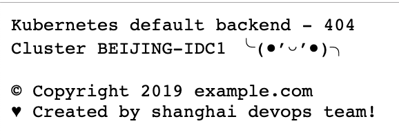

# 背景

在企业的 Kubernetes 实践中，存在和虚拟机系统共存的情况。有的时候应用部署在虚拟机，有的时候部署到 Kubernetes 集群。在配置完成前端的域名解析和转发之后，如果后端的服务还没有部署，那么很容易出现 404 的情况。Ingress Nginx Controller 的默认的 404 的页面过于简洁，而且当有多副本集群的时候，也没有办法判断是否域名配置已转发到多个集群上面。在这种情况下，我们需要一个内容更加丰富的 404 页面。

# 方案

Ingress Nginx Controller 的默认 404 页面响应的后端 Pod 在空间 `ingress-nginx` 下面。有个名称叫做 `default-http-backend` 的 Deploymen，这个是全局的404响应服务。默认情况下，这个服务返回的内容是 `default backend - 404`。有的时候这个响应不太能够帮助我们快速定位问题。

所以我们可以自定义这个服务。我们额外写一个http的服务，监听8080的端口，当请求路径为 `/healthz` 健康检查时返回200；其他的情况下返回404，并且给一个较为详细的回复内容。在这个内容里面我们可以给出更加详细的信息，包括命中的集群信息等。

## 实施

在部署的时候，我们只需要覆盖掉同名的 Deployment 即可，不需要再去创建新的 Service，直接使用原来的 Service 即可。原来的 Service 里面把暴露的 80 端口映射给了我们的后端服务的 8080 端口。

```
➜  ~ kubectl get svc default-http-backend -n ingress-nginx -o yaml
apiVersion: v1
kind: Service
metadata:
  creationTimestamp: 2018-04-06T15:26:59Z
  labels:
    app: default-http-backend
  name: default-http-backend
  namespace: ingress-nginx
  resourceVersion: "1727455"
  selfLink: /api/v1/namespaces/ingress-nginx/services/default-http-backend
  uid: f3076744-39ae-11e8-90f4-427775cbe8d8
spec:
  clusterIP: 10.1.187.249
  ports:
  - port: 80
    protocol: TCP
    targetPort: 8080
  selector:
    app: default-http-backend
  sessionAffinity: None
  type: ClusterIP
status:
  loadBalancer: {}
```

## 效果


