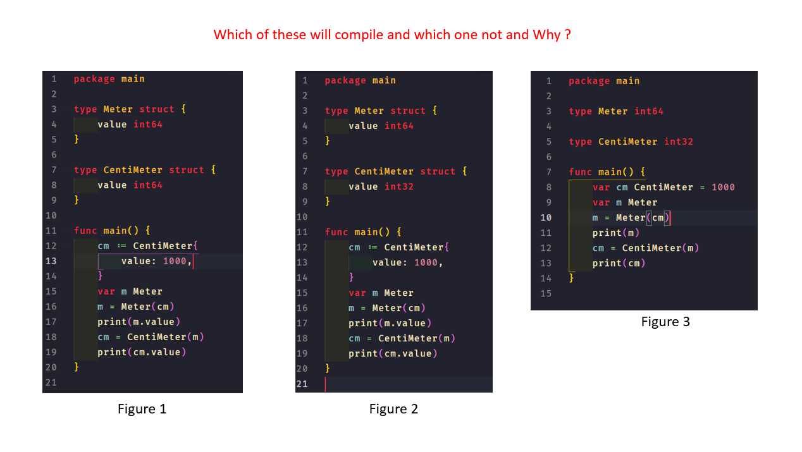
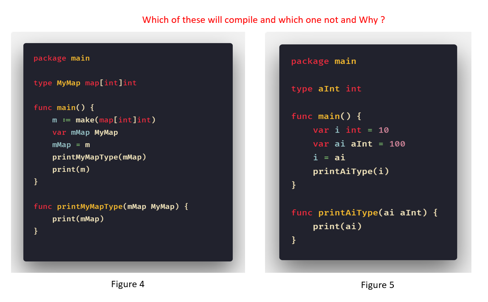
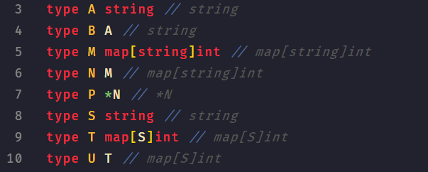

# 深入了解 Go 的类型系统

**作者：Ankur Anand**

**原文地址：https://blog.ankuranand.com/2018/11/29/a-closer-look-at-go-golang-type-system/**

本文是一篇译文，主要通过一些例子来详细了解下 Go 的类型系统。

## 正文

让我们从一些基本的问题开始。

### 为什么需要类型？

在回答这个问题之前，我们需要先看下我们一般不会接触到的关于编程语言的一些最原始的抽象层。

我们能接触到的关于机器描述数据的最基本层面是关于二进制的 0 和 1。这些就是机器能够理解的内容。

但是这些 0 和 1 对我们有意义么？至少对我来说毫无意义，除非有一天或许我可以像某些厉害的角色一样，或者是在计算机科学方面“开了天眼”。

所以我们可以上一个台阶，对这些 0 和 1 做一层抽象。

可以考虑下汇编语言里面的寄存器。比如有三个寄存器 R1，R2，R3。你能知道这三个寄存器里面存储的是什么类型的数据么？

```
add $r1, $r2, $r3
```

因为在汇编语言层面是无法判断的，你或许会以为它们是整型。但是实际上，寄存器R1，R2，R3里面可以存储任意类型的数据。毕竟它们只是一些里面存储 0 和 1 的寄存器。加法运算虽然并不理解寄存器里面存储的数据，但是一样可以把它们加起来然后生成一个新的值再存储起来。

所以，数据类型的概念起源于更高的抽象，诸如在高级编程语言 C，Go，Java，Python 和 Javascript 中。数据类型是编程语言自身的特性。有些编程语言在运行的时候做类型检查，有些则是在编译期间。

### 那么什么是类型？

对于不同的编程语言来讲，数据类型的概念也有所不同。可以通过几种不同的方式来阐述数据类型的定义，但是基本上核心都是一致的。

1. 数据类型代表一组值；
2. 同时代表一些可以在这些值上面进行的操作。例如，对于整数类型，我们可以执行加法和减法；对于字符串类型，我们可以执行拼接，检查是否为空等等；
3. 对于变量的类型检查一般是放在编译期间或者运行时，通过这些检查来确保数据的完整性，以及确保对数据的理解符合开发者的预期。

**所以一门编程语言的类型系统指定了对特定类型的数据可以执行的合法操作。**

类型检查的目标是确保针对了正确的数据类型执行了运算操作，同时也确保程序遵循了类型系统设定的规则。这些检查要么是在编译期间对代码做转换的时候或者是在运行时执行代码的时候。通过这些操作，类型检查确保了对数值的理解符合预期。当我们到达机器层面的代码时，就不需要再检查什么了，因为都是 0 和 1 而已。对于这些 0 和 1，我们让机器做什么，机器就会做什么。

类型系统确保了对由 0 和 1 的比特位构成的数值的理解符合预期。例如，它确保不会在由 0 和 1 的比特位构成的整型数值上面执行一些非整型运算操作。毕竟这些操作是毫无意义的。

一个类型系统包含如下几个部分：

1. 基础类型 - 这些类型是包含在编程语言中的并且可以在任何由该编程语言编写的程序中使用。Go 也有一些基础类型，例如 int8，uint8，int16，uint16，int32，uint32 等；
2. 类型定义方法 - 编程语言提供的一种构造新的数据类型的方法。例如指向 T 的指针，其中 T 是基础类型或者是一个结构体类型；
3. 类型推断 - 编译器可以在我们并不显式指定变量的类型的时候自动推断出它的类型。Go 拥有单向的类型推断功能；
4. 类型兼容 - 类型系统允许的赋值类型。例如 `a int; b int8; a=b;` 这样的操作是否允许；如何判断两个类型相等；

### Go 中的类型系统

Go 的类型系统中有一些最基本的规范，我们将审视一些重要的部分。

在把所有的概念铺开之前，我想通过一些不同的例子来讲解 Go 类型系统的一些基本概念。我会在带领你研究这些例子的同时给你讲解一些重要的概念。

现在来仔细看下这几个代码片段，研究下哪个片段可以成功编译，另外无论是否可以解释下为什么。





我希望你把你的答案和分析的原因记下来，这样我们在最后可以一起讨论下。

#### 命名类型

预定义的类型如 int，int64，float32，string 和 bool 都成为命名类型。即所有的预定义的 boolean，数值和字符串类型都是命名类型。

另外，我们使用类型声明方式定义的类型也叫做命名类型。

```go
var i int // 命名类型
type myInt int // 命名类型
var b bool // 命名类型
```

一个已定义的命名类型总是和另外一个类型不同。

#### 未命名类型

组合类型 - 数组，结构体，指针，函数，接口，切片，字典和通道类型都是未命名类型。

```
[]string // 未命名类型
map[string]string // 未命名类型
[10]int // 未命名类型
```

上面组合类型中的基础类型描述了组合类型的构成方式，但是没有对组合类型进行命名。

#### 底层类型

每个类型 T 都有对应的底层类型。

如果类型 T 是一个预定义的布尔，数值或者是字符串类型，那么它的底层类型就是 T 本身。否则 T 的底层类型就是类型 T 定义中所引用的的各类型。



按照每行来解释各个类型：

1. 第 3 行和第 8 行： 其中的 string 类型是预定义的类型，所以底层类型就是 T 自身
2. 第 5 行和第 7 行： 这里的类型都是字面类型，所以底层类型就是 T 自身，即 map[string]int 和指针 *N ，这些类型也是未命名类型
3. 第 4，6，10 行： T 的底层类型就是 T 的类型定义中所引用的类型。例如 B 指向 A，所以 B 的底层是一个字符串类型

这里我们需要再重点看下第 9 行，即 `type T map[S]int`。

这里 S 的底层类型是字符串类型，即 string。那么类型 `type T map[S]int` 的类型难道不是 `map[string]int` 而是 `map[S]int` 么？这里我们讨论的是未命令类型 `map[S]int` 的底层类型，它的底层类型判断在遇到第一个未命令类型的时候截止（即如规范所说，”如果 T 是一个字面类型，那么 T 对应的底层类型就是 T 本身“）。

你或许会好奇我为什么特别强调这些关于未命名类型，命名类型和底层类型的规范。因为这对于我们后面将要讨论的内容至关重要。这些规范会帮助我们理解为什么上面的例子虽然意图几乎是一样，但是有些可以编译成功，有些则不行。

#### 可赋值性

可赋值性的要求是在把一个变量 v 赋值给一个类型 T 的变量的时候必须遵循的规则。